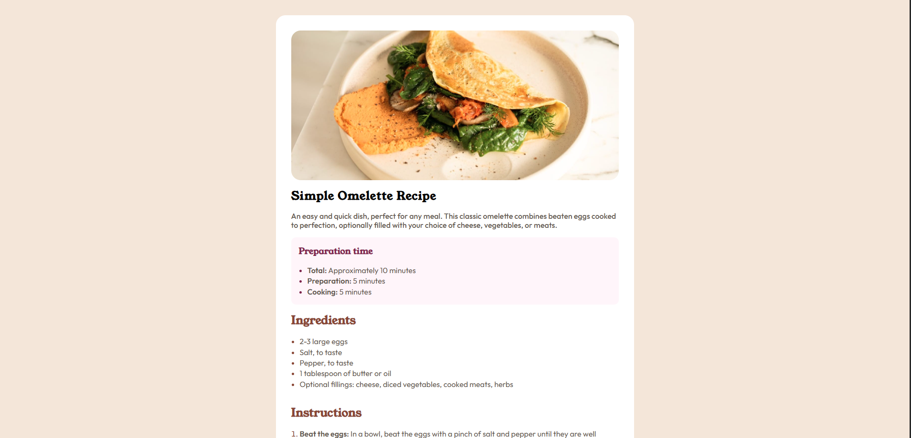

# Frontend Mentor - Recipe page solution

This is a solution to the [Recipe page challenge on Frontend Mentor](https://www.frontendmentor.io/challenges/recipe-page-KiTsR8QQKm). Frontend Mentor challenges help you improve your coding skills by building realistic projects.

### Screenshot

### Links

- Solution URL: [solution URL here](https://www.frontendmentor.io/solutions/recipe-page-solution-jStk9wtC8e)
- Live Site URL: [live site URL here](https://recipe-page-solution-mohamed-ahmed.netlify.app/)

### Built with

- CSS custom properties
- Flexbox
